<div align="center">
  
  <h1 align="center">Machine Learning And Algorithms Project</h1>
</div>

## Introduction
Smile is an open source machine learning project that uses convolutional neural networks to identify emotions from facial expressions of humans. The model is built using the Keras and Tensorflow libraries, while OpenCV is used to take video input. The dataset used for this project can be found on Kaggle at https://www.kaggle.com/datasets/jonathanoheix/face-expression-recognition-dataset. We have also created a web application for the model using the Streamlit platform.

## Technical Details
- OpenCV: OpenCV (Open Source Computer Vision Library) is an open-source computer vision and machine learning software library. It will be used for image pre-processing and feature extraction.
- CNN: Convolutional Neural Networks are a type of deep learning models specifically designed for image classification tasks. They will be used for emotion recognition in this project.
- Streamlit: Streamlit is an open-source Python library that allows developers to create web applications for machine learning and data science projects quickly and easily, without needing to have any web development skills. With Streamlit, developers can create interactive web apps with just a few lines of code.

## Getting Started

### Requirements
- OpenCV 4.4.0 or higher
- Python 3.7 or higher
- TensorFlow 2.3 or higher
- Keras 2.4 or higher
- Streamlit 1.20.0 or higher

### Setup
1. Clone the repository<br>
```
git clone https://github.com/MausmiSinha/Facial_Detection_Project.git
```
2. Install the required packages
```
pip install -r requirements.txt
```
## Usage

1. Run the `run.py` file to start the video input.
    ```
    python run.py
    ```

2. The emotions detected from the video will be displayed on the screen.

## Web Application

1. To run the web application, execute the following command:

    ```
    streamlit run app.py
    ```

2. Open the URL displayed in the console in your web browser to use the application.

### Data
The dataset used for training the model can be found in the `images` folder. It contains images of faces with annotations of emotions.

## Screenshots:
<div align="center">
  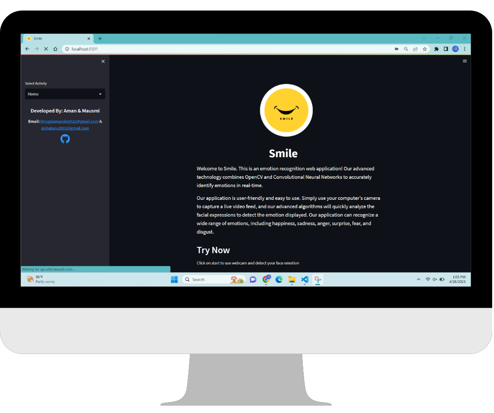
  
  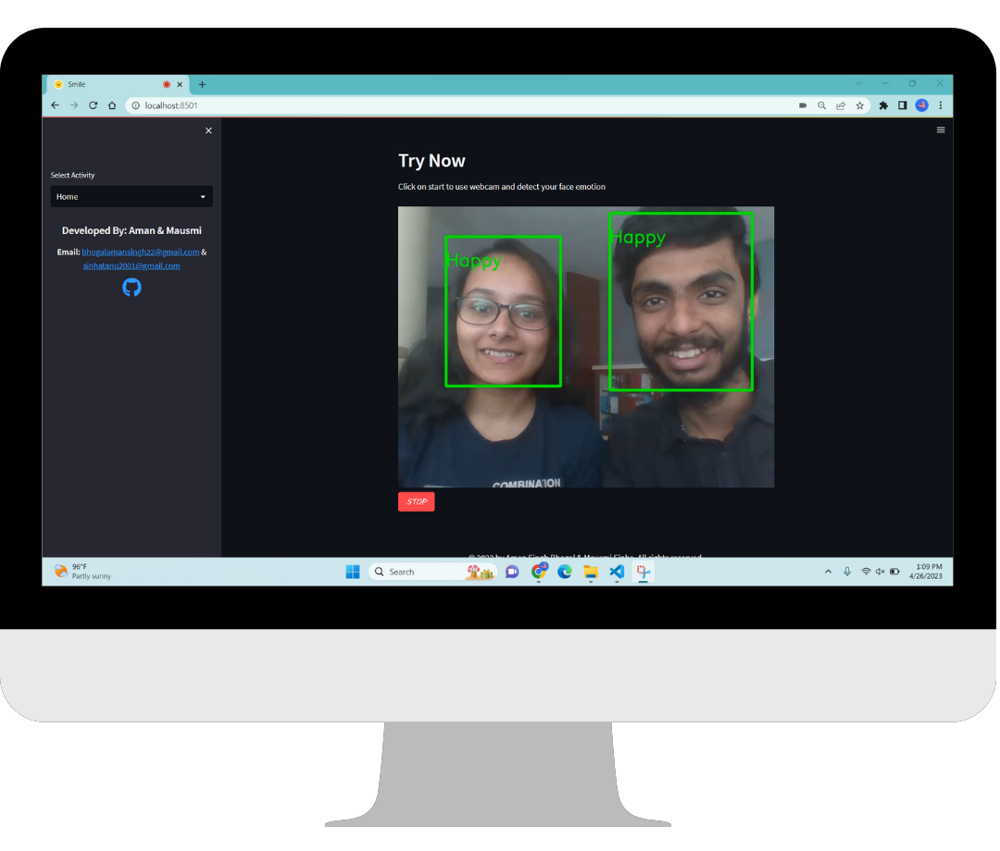
  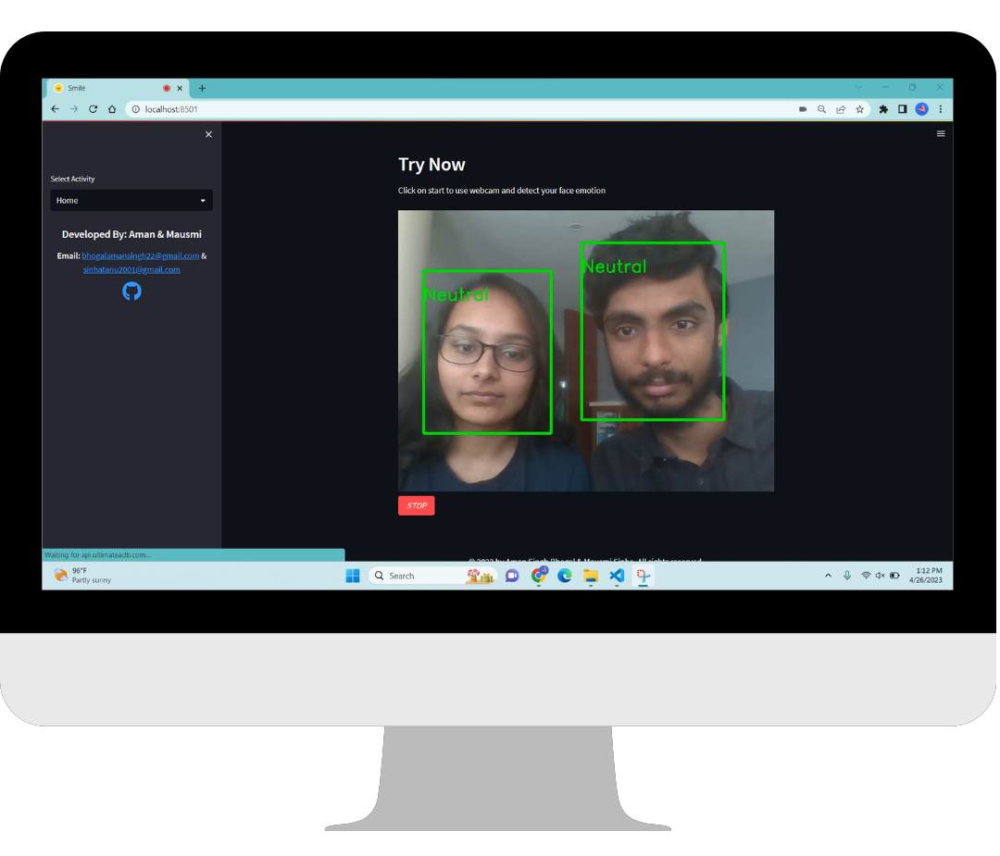
  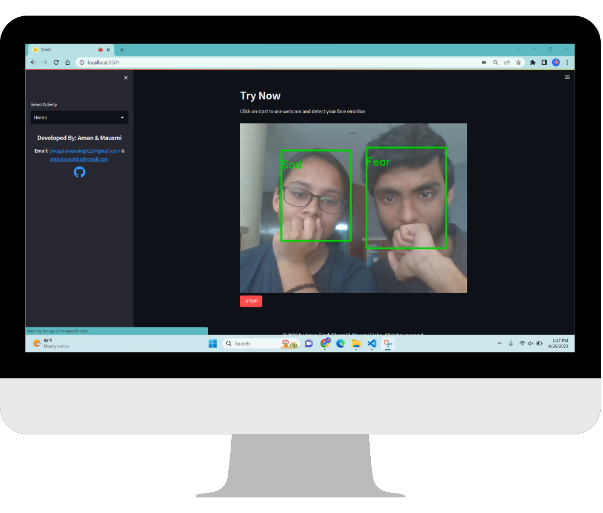
  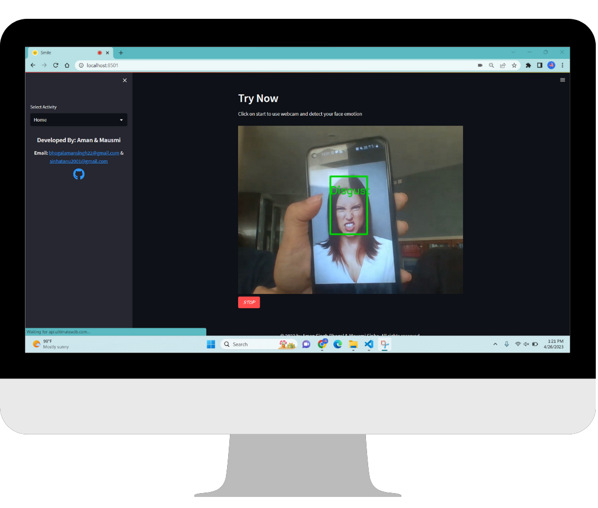
  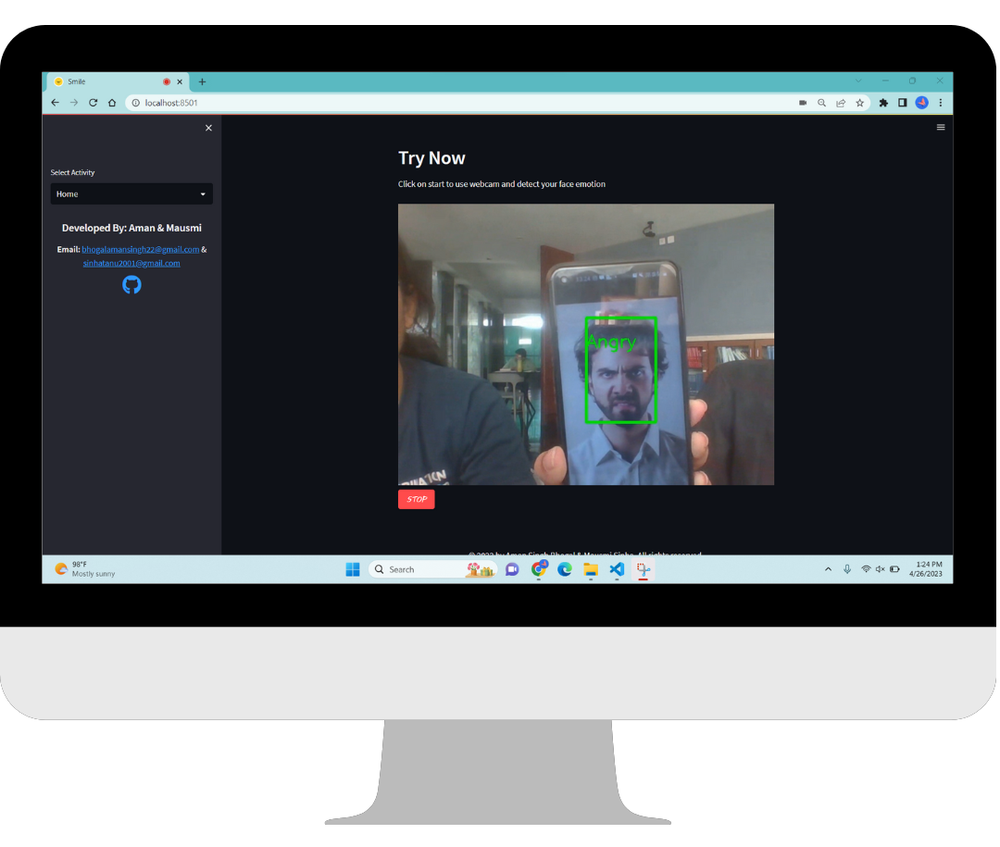
  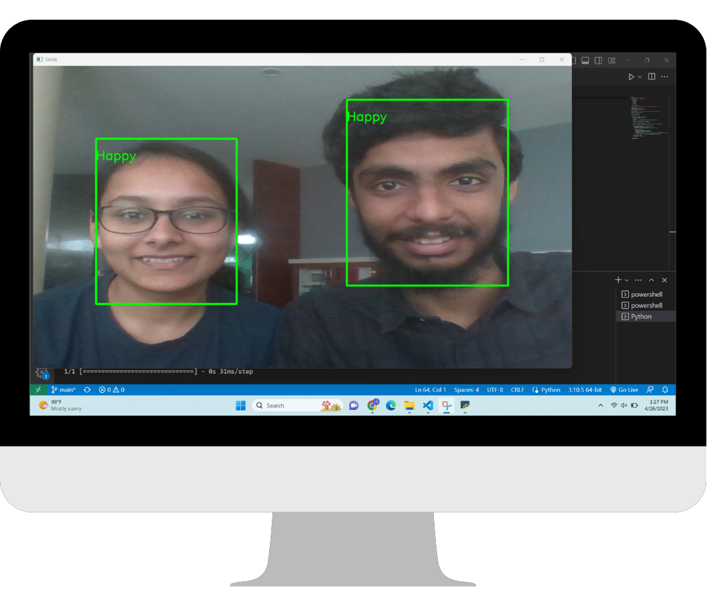
  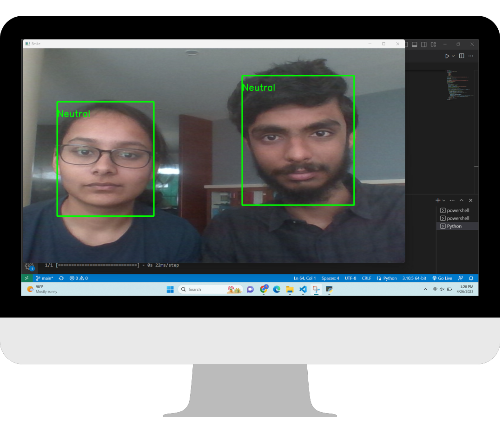
  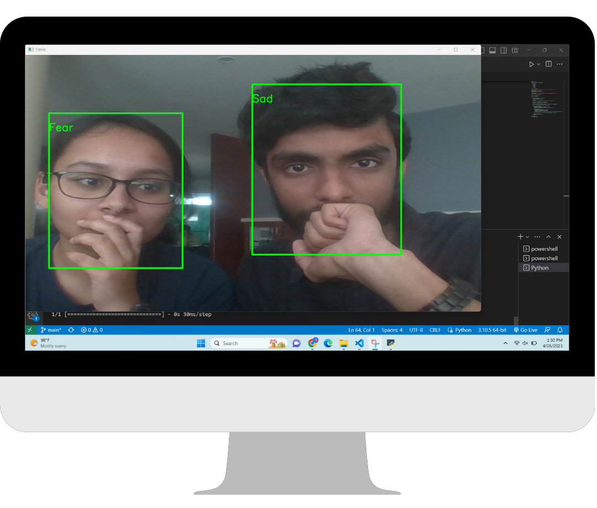
  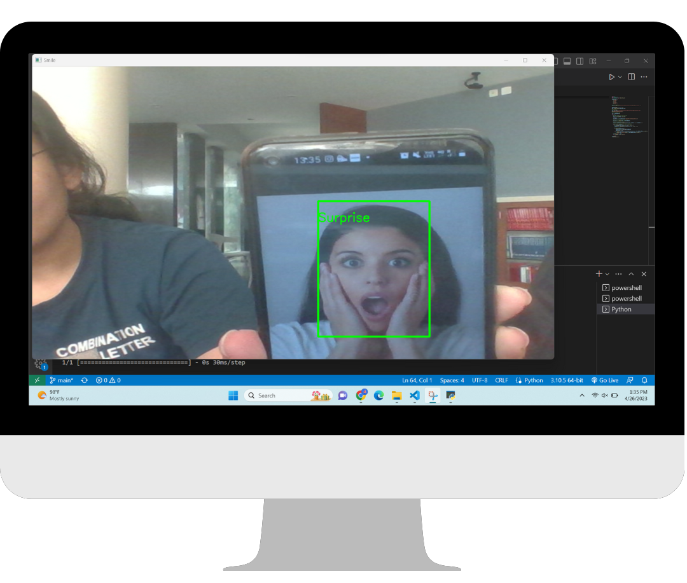
  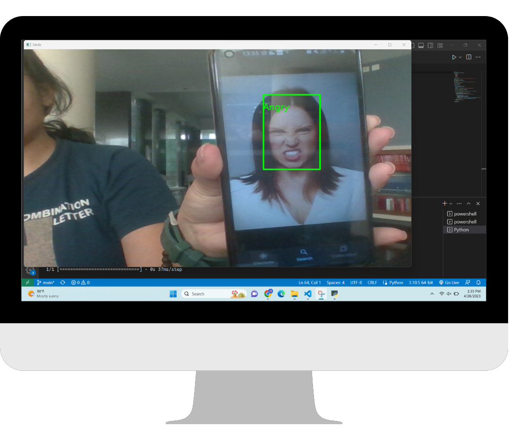
  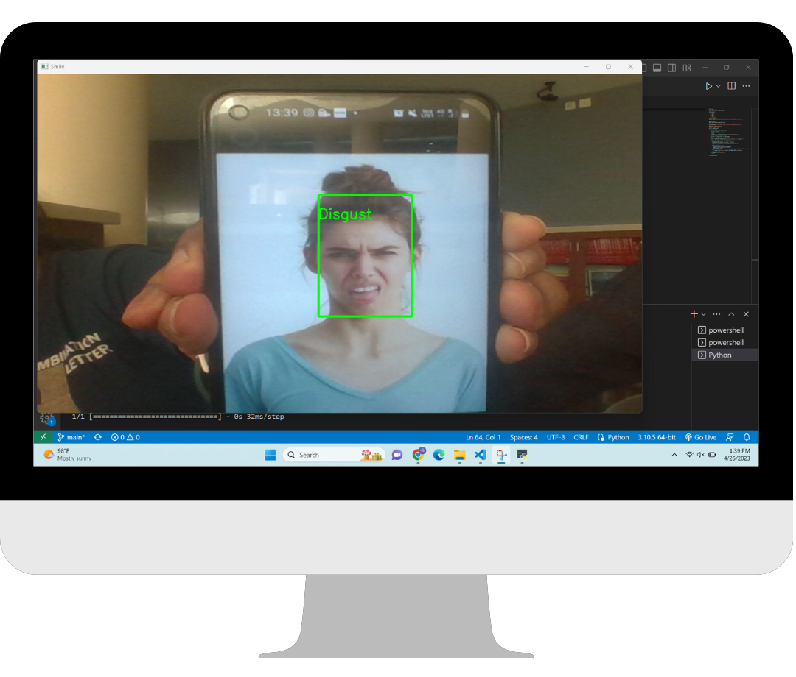
  
</div>

## Contributing

If you wish to contribute to this project, please follow these steps:

1. Fork the repository
2. Create a new branch
3. Make your changes and commit them
4. Push your changes to your forked repository
5. Create a pull request to merge your changes into the main repository

## License

This project is licensed under the MIT License. See the `LICENSE` file for details.

## Conclusion
This project serves as a starting point for building a Facial Emotion Recognition system using OpenCV and CNN algorithms. It can be further improved by adding more data and fine-tuning the model.
